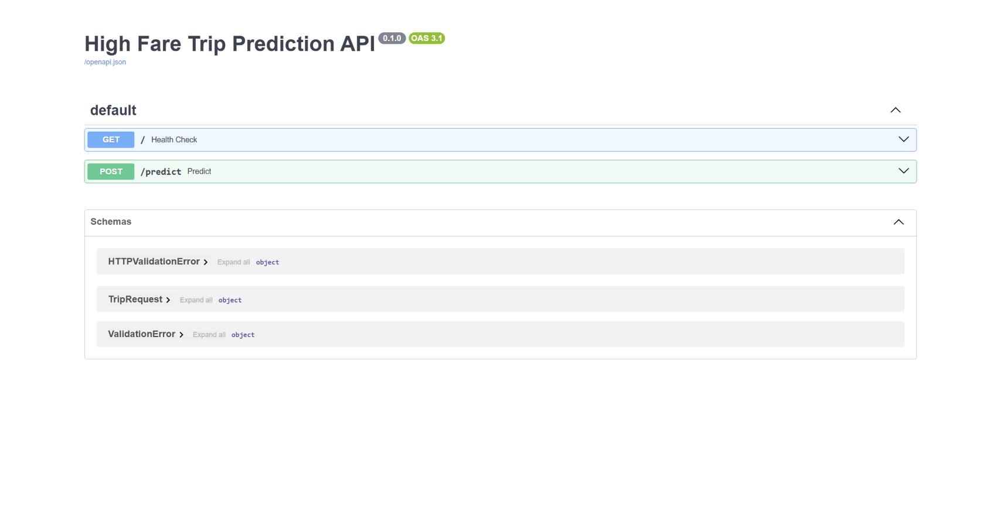
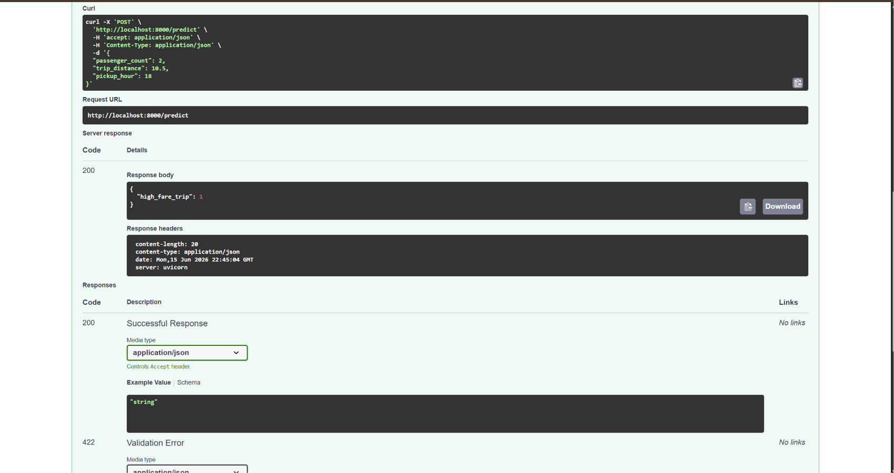

# Real-Time and Batch ML Serving Platform

## Overview

This project demonstrates an end-to-end machine learning serving solution built using Python, Scikit-Learn, FastAPI, Docker, and GitHub.

The objective is to predict whether a NYC taxi trip is likely to be a high-fare trip based on information available before or near trip start.

The platform supports:

* Machine Learning model training
* Real-time inference using FastAPI
* Batch prediction for large datasets
* Docker containerization
* Model performance benchmarking
* Production-style project documentation

---

## Business Problem

Transportation and mobility companies often need to identify potentially high-value trips for pricing analysis, operational planning, and demand forecasting.

This project builds a machine learning classifier that predicts whether a taxi trip is expected to result in a high fare.

---

## Dataset

**Source:** NYC TLC Yellow Taxi Trip Records – January 2024

Dataset location:

```text
data/yellow_tripdata_2024-01.parquet
```

The dataset is excluded from source control due to file size.

---

## Prediction Target

Target Variable:

```text
high_fare_trip
```

Definition:

```text
1 = High Fare Trip
0 = Non High Fare Trip
```

The target is derived from fare values using a percentile-based threshold.

---

## Features Used

The model uses only information available before or near trip start:

* passenger_count
* trip_distance
* pickup_hour

### Leakage Prevention

The following fields were intentionally excluded:

* fare_amount
* total_amount
* tip_amount
* tolls_amount
* dropoff timestamps

These values are only available after trip completion and would introduce target leakage.

---

## Setup Instructions

### Clone Repository

```bash
git clone https://github.com/bsriramtechie28-star/real-time-batch-ml-serving.git
cd real-time-batch-ml-serving
```

### Create Virtual Environment

```bash
python -m venv venv
```

Windows:

```bash
venv\Scripts\activate
```

### Install Dependencies

```bash
pip install -r requirements.txt
```

---

## Model Training

Train the machine learning model:

```bash
python src/train.py
```

This generates:

```text
models/high_fare_model.pkl
```

---

## Model Performance

Performance on the evaluation dataset:

| Metric    | Score |
| --------- | ----- |
| Accuracy  | 94%   |
| Precision | 0.92  |
| Recall    | 0.85  |
| F1 Score  | 0.88  |

Detailed benchmark information is available in:

```text
benchmarks/benchmark.md
```

---

## Real-Time API

Start the FastAPI application:

```bash
uvicorn app.main:app --reload
```

Swagger UI:

```text
http://localhost:8000/docs
```

Available endpoints:

```text
GET /
POST /predict
```

---

## API Usage Example

### Request

```json
{
  "passenger_count": 2,
  "trip_distance": 10.5,
  "pickup_hour": 18
}
```

### Response

```json
{
  "high_fare_trip": 1
}
```

---

## API Documentation

### Swagger UI



### Sample Prediction Response



---

## Batch Prediction

Generate predictions for large datasets:

```bash
python src/batch_predict.py
```

Output:

```text
data/batch_predictions.csv
```

The same trained model is used for both batch and real-time inference.

---

## Docker Deployment

### Build Image

```bash
docker build -t high-fare-api .
```

### Run Container

```bash
docker run -p 8000:8000 high-fare-api
```

### Verify Deployment

Open:

```text
http://localhost:8000/docs
```

Swagger UI should load successfully.

---

## Project Structure

```text
app/
│   main.py
│
benchmarks/
│   benchmark.md
│
docs/
│   dataset.md
│   design_notes.md
│   screenshots/
│       swagger-ui.png
│       prediction-response.png
│
models/
│   high_fare_model.pkl
│
src/
│   train.py
│   batch_predict.py
│   check_data.py
│
tests/
│
Dockerfile
.dockerignore
.gitignore
README.md
requirements.txt
```

---

## Documentation

Additional project documentation:

```text
docs/dataset.md
docs/design_notes.md
benchmarks/benchmark.md
```

---

## Engineering Considerations

This project demonstrates several machine learning engineering practices:

* Feature leakage prevention
* Reproducible model training
* Model serialization
* Batch inference workflows
* Real-time API serving
* Docker containerization
* Git version control
* Documentation-driven development

---

## Future Enhancements

Potential improvements include:

* Automated unit tests
* GitHub Actions CI/CD pipeline
* MLflow experiment tracking
* Model versioning
* Monitoring and drift detection
* Cloud deployment on AWS, Azure, or GCP

---

## Technologies Used

* Python
* Pandas
* NumPy
* Scikit-Learn
* FastAPI
* Uvicorn
* Docker
* Git
* GitHub

---

## Author

**Sriram B**

Senior AI/ML Engineer

This project demonstrates model training, batch inference, real-time API serving, Docker deployment, and production-oriented machine learning engineering practices.
